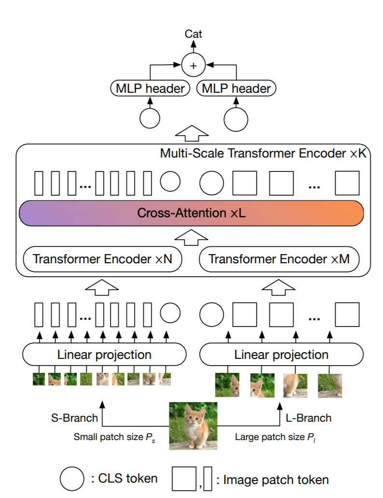

# CrossViT : Cross-Attention Multi-Scale Vision Transformer for Image Classification
This is an unofficial PyTorch implementation of [CrossViT: Cross-Attention Multi-Scale Vision Transformer for Image Classification](https://arxiv.org/abs/2103.14899) .



## Usage :
```python
import torch
from crossvit import CrossViT

img = torch.ones([1, 3, 224, 224])
    
model = CrossViT(image_size = 224, channels = 3, num_classes = 100)
out = model(img)

print("Shape of out :", out.shape)      # [B, num_classes]


```

## Citation
```
@misc{chen2021crossvit,
      title={CrossViT: Cross-Attention Multi-Scale Vision Transformer for Image Classification}, 
      author={Chun-Fu Chen and Quanfu Fan and Rameswar Panda},
      year={2021},
      eprint={2103.14899},
      archivePrefix={arXiv},
      primaryClass={cs.CV}
}
```

## Acknowledgement
* Base ViT code is borrowed from [@lucidrains](https://github.com/lucidrains) repo : https://github.com/lucidrains/vit-pytorch
